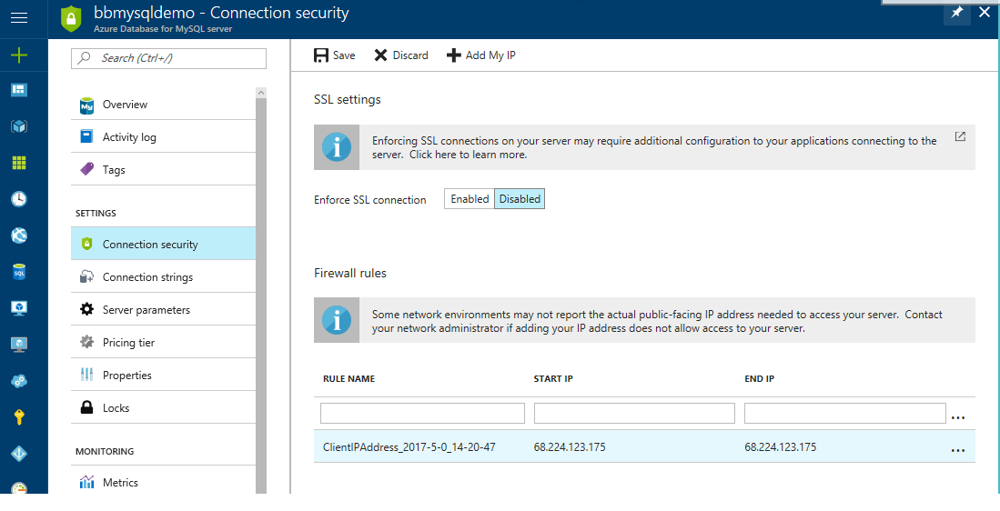

# Build a Java and MySQL App on a VM in Azure

## Objectives

This demo shows you how to create a simple  [Spring Boot](https://projects.spring.io/spring-boot/) Java App on a VM with data stored in [Azure Database for MySQL](https://docs.microsoft.com/azure/mysql/overview) running on an [Azure Virtual Machine](https://azure.microsoft.com/services/virtual-machines/).

## Requirements

Note that you will need an Azure account to follow along. If you don't have one, you can get a free trial [here.](https://azure.microsoft.com/en-us/free)

## Setup Steps

I'm going to show you the easiest way to do each of these steps - and that's going to take us on a tour of the [Azure portal](https://azure.microsoft.com/en-us/features/azure-portal/),the [Azure CLI](https://docs.microsoft.com/en-us/cli/azure/overview) and the [Windows Subsystem for Linux](https://msdn.microsoft.com/en-us/commandline/wsl/about), aka Bash on Windows.  

### Create the Azure Database for MySQL:

You can create and manage Azure Database for MySQL instances using the Azure Portal or the Azure CLI.  Today I'll show you the portal.  

To get started, go to the [Azure Portal](https://portal.azure.com/) and Navigate to New>Databases, then select Azure Database for MySQL.

Enter the details as needed and choose the default pricing tier.  Click OK to create your new Azure Database for MySQL service.

The next task is configuring connection security for your app.  Open your Azure Database for MySQL service in the portal, and under SSL settings, Click "Disable" for "Enforce SSL Connection".  SSL is important for a production application to avoid "man in the middle" attacks, but for this simple demo it's overkill.  You can read more about configuring SSL with Azure Database for MySQL [here.](https://docs.microsoft.com/en-us/azure/mysql/howto-configure-ssl)

Next up, let's configure a Firewall rule.  We're going to connect to the Azure Database for MySQL service from your local machine first, so you can simply click the "Add My IP" button on the top menu to add your local IP address.  

Click save to complete the configuration.  You now have a MySQL Database that is only accessible from your local machine, 

### Create the table in MySQL
You’ll need to create the table for the application through this SQL: 
CREATE TABLE todo_item ( id int auto_increment, name varchar(255), category varchar(255), complete bool, primary key (ID));

### Configure and run the project locally
Clone the code from [GitHub](https://github.com/<admin>/spring-boot-todo).  
Next, make changes to the application.properties file in src/main/resources folder to point to your new Azure Database for MySQL instance.
Note that the application performs a connectivity test and will not run unless it can access MySQL.  

To run the application, navigate to the directory where the application's pom.xml resides,and type in a comand prompt:

mvnw package spring-boot:run

Navigate to http://localhost:8080.  You should see this application up and running when done.

### Compile and deploy the application to an Azure virtual machine

Next up, let's move the application to a VM on Azure, set up the VM and run the app.

First, exit the current application runnig onthe command line with ctrl-c.
then compile the application an produce a .war file:
mvn package

Note that during compile, tests will run, and the tests need to be able to accesss the MySQL Database or the build will fail.

The build will generate a file in the target directory called TodoDemo-0.0.1-SNAPSHOP.war

To run the application, use the java -war command:
java -jar target/TodoDemo-0.0.1-SNAPSHOP.war

Navigate to http://localhost:8080 again, and make sure the application is up and running from the .war file. Exit the application with ctrl-c.

### Deploy the .war file to an Azure virtual Machine.  

 
### Login to the CLI
1. [Install the Azure CLI 2.0](https://docs.microsoft.com/cli/azure/install-azure-cli) on Windows, Mac or Linx.  

Once installed, authenticate with Azure:
az login

### Create the VM: 
Here's the command to create a resource group, then an Ubuntu Linux VM:

az group create -l westus2 -n <myResourceGroupName>
az vm create -n bbmysqlvmdemo -g <myResourceGroupName> -l eastus2 --generate-ssh-key --image "Canonical:UbuntuServer:16.04-LTS:16.04.201702240"

### copy the war file using SCP

scp /mnt/c/Users/<admin>/Documents/GitHub/spring-boot-todo/target/TodoDemo-0.0.1-SNAPSHOT.war <admin>@<VMIPAddress>:~/

If you get the message: "The authenticity of host '<VMIPAddress> (<VMIPAddress>)' can't be established.
ECDSA key fingerprint is ...Are you sure you want to continue connecting (yes/no)?" - type yes

### open the port 8080 on the target VM:
The Java app needs port 8080 to run:
az vm open-port -g <myVMName> -g <myResourceGroupName> --port 8080

### get the IP address for your new VM and add it to these command. If no AdminId specificed, then your account email to the left of the @ is usually the default.

az vm list -g <myResourceGroupName> -o table
scp /mnt/c/Users/<admin>/Documents/GitHub/spring-boot-todo/target/TodoDemo-0.0.1-SNAPSHOT.war <admin>@<VMIPAddress>:~/

### Log into VM via SSH
ssh <admin>@<VMIPAddress>

### Update Linux then get Azul's OpenJDK 8 via apt-get

sudo apt-get update
sudo apt-get install -y openjdk-8*

### Start a second terminal window to start the API on the server

ssh <admin>@<VMIPAddress>
java -jar ./TodoDemo-0.0.1-SNAPSHOT.war

## Other options for running on the server:

### To run this demo on the server from tmux (will not shut down when you disconnect):

ssh <adminUID>@<vm IP Address>
tmux 
java -jar ./TodoDemo-0.0.1-SNAPSHOT.war

###To go back in
tmux attach-session -t 0

###Key tmux controls 
ctrl+B % new window
ctrl+B o switch windows
ctrl b d detach tmux and go back to terminal

### Alternative to tmux - run via background Java on the server 
java -jar ./TodoDemo-0.0.1-SNAPSHOT.war >api.out 2>&1 &

### Check the background jobs, bring processes to the foreground, list the last few responses from the API and the client:
jobs
fg 1 
tail -f *.out

## Clean up - Delete resource group.
az group delete <myResourceGroupName> --no-wait

## Demo Steps
See the demo video listed in the Session README.md for an example of how to show this application in action and walk through the setup.